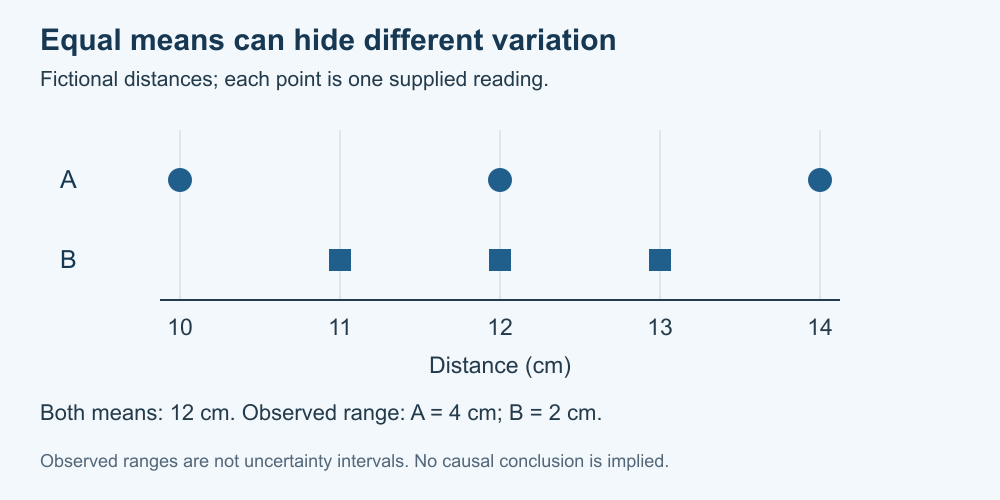

# 6. Patterns, summaries and uncertainty

[Course home](../README.md) · [Glossary](../GLOSSARY.md)

**Goal:** Summarise a small dataset without hiding its variation.

Adults 18+. All named people, examples, role cards and datasets are fictional. Use paper or an accessible equivalent; a calculator is optional.

## Understand

A table preserves individual entries; a graph can make comparisons easier. Label quantities and units, use a clear scale and keep the underlying values available. A summary is useful only if the reader knows what it summarizes.

For this course, the arithmetic mean is the sum divided by the number of readings. The observed range is maximum minus minimum. Neither alone describes all uncertainty, explains a cause or establishes a population result.

Two groups can share a mean but have different variation. A small difference between means is not automatically meaningful. This course does not calculate confidence intervals, statistical significance or a probability that a hypothesis is true.

Text equivalent: Fictional A values are 10, 12, 14 cm; B values are 11, 12, 13 cm. Both means are 12 cm, but ranges differ.

## Worked example

Fictional distances A: 10, 12, 14 cm; B: 11, 12, 13 cm. Each sum is 36 cm and each mean is 12 cm. A ranges from 10 to 14 (range 4 cm); B from 11 to 13 (range 2 cm). The shared mean hides the different spread.

## Practise

For fictional C: 8, 10, 12 cm and D: 9, 10, 11 cm, calculate each sum, mean and range. Describe one thing a mean-only chart would hide.

## Suggested reasoning

C and D each sum to 30 cm and each mean is 10 cm. C's range is 4 cm; D's is 2 cm. A mean-only chart would hide the individual readings and different spreads. These three readings per group do not establish which process is more reliable in general.

## Try a new situation

A graph shows only 10–12 cm on its axis without clearly marking the scale. What would you check before accepting a dramatic difference? Check: inspect axis limits, raw values, units and what was omitted; a truncated axis needs clear context.

[Sources and limits](../SOURCES.md) · [Next lesson](07-checking.md) · [Reuse](../LICENSE.md)
