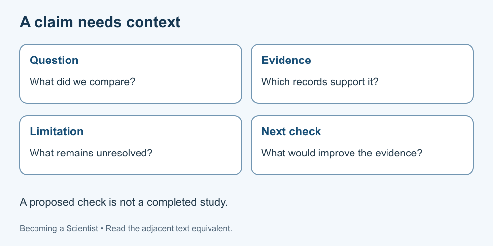

# 10. A complete investigation on paper

[Course home](../README.md) · [Glossary](../GLOSSARY.md)

**Goal:** Connect a claim to data, limitations and a better next check.

Adults 18+. All named people, examples, role cards and datasets are fictional. Use paper or an accessible equivalent; a calculator is optional.

## Understand

Use only the fictional records below. They are authored to teach reasoning, not measurements of real ramps or materials. Do not construct or run a physical experiment.

A good report distinguishes what the data show from what might explain it. Include enough detail to check the calculation and identify what the design cannot resolve. A proposed next check is a plan requiring its own suitability assessment, not a claim that it occurred.

Text equivalent: Report the question, evidence, limitation and proposed next check separately.

## Worked example

Mini-example: readings 4 and 6 cm have mean 5 cm. The correct mean does not tell you which surface, instrument or starting height produced them. Arithmetic correctness and adequacy of the evidence are separate questions.

## Practise

Fictional records:

| Group | Surface label | Starting height | Travel distances |
|---|---|---|---|
| A | smooth | 10 cm | 20, 22, 24 cm |
| B | textured | 20 cm | 28, 30, 32 cm |
| C | textured | 10 cm | 19, 22, 25 cm |

The record does not specify assignment, release method, object identity, instrument uncertainty or whether each reading came from a separate run. “Smooth” and “textured” are labels, not measured roughness.

Claim 1: “B proves textured surfaces always make objects travel farther.”
Claim 2: “These records show a higher mean for B, but the height differs; A and C have equal means with different ranges, and further design information is needed.”

1. Calculate each total, mean and range, with units.
2. Compare the claims. Explain the confound in A versus B and the limits of A versus C.
3. Separate two observations from one possible explanation.
4. Propose a better comparison on paper, listing what must be clarified and what would be recorded.
5. Write a four-sentence report: question, evidence, limitation, next check.
6. Explain why publishing an invented “extra run” as real evidence would be unacceptable.

## Suggested reasoning

A: total 66 cm, mean 22 cm, range 4 cm. B: total 90 cm, mean 30 cm, range 4 cm. C: total 66 cm, mean 22 cm, range 6 cm. B's mean exceeds A's by 8 cm.

Claim 2 is better bounded. A and B differ in both surface label and starting height. A and C share a stated height but other methods remain unknown; equal means do not establish equal behaviour in general. Observations include the listed values and heights. Height is one possible contributor to B's larger distances, not a demonstrated sole cause.

A proposed comparison could hold starting height and object constant, define surface and release method, specify measurement and assignment/order, record individual results and use suitable repeated runs. Ask whether records are independent runs. Do not infer a sample size beyond the three supplied readings per group.

Example report: “We compared fictional travel-distance records. B has mean 30 cm while A and C each have mean 22 cm. Height differs for B and important methods are missing, so these records do not isolate a surface effect. A future suitably supervised design would need comparable conditions, defined measurement and individual records.”

Keep invented teaching data labelled as such. An invented extra run presented as real observation misrepresents the evidence.

## Try a new situation

New fictional comparison: groups D and E use the same surface and height, but different objects. What new confound remains? Check: object differences could contribute; matching two conditions does not match all relevant conditions.

[Sources and limits](../SOURCES.md) · [Review your work](../FACILITATOR-GUIDE.md) · [Reuse](../LICENSE.md)
