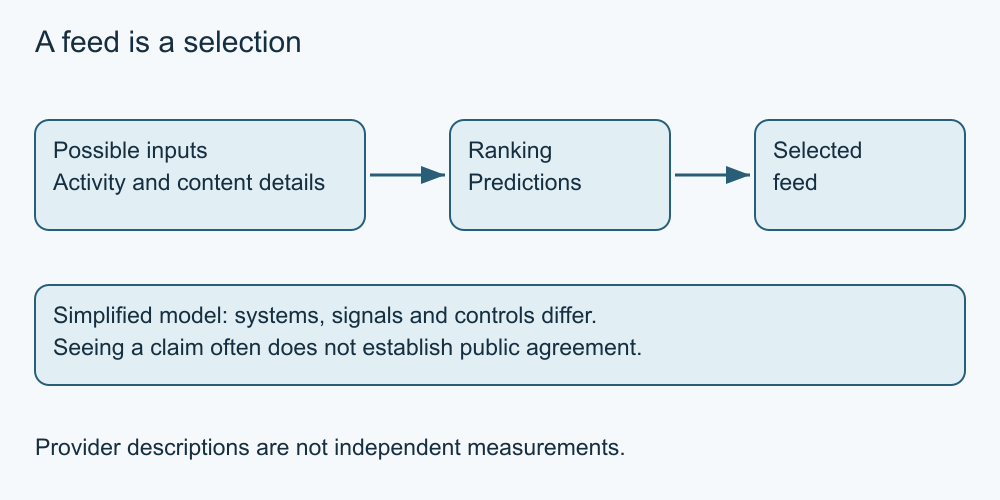

# 2. Understand a feed

[Course home](../README.md) · [Curriculum](../CURRICULUM.md)

**Learning goal:** Explain why a feed is a selection rather than a complete picture.

A feed is an arranged selection of posts. Some services offer chronological views; others rank material using predictions about what a person may find relevant or engage with. A recommended post can come from an account you do not follow. Advertising may appear alongside other content. Available controls and labels vary.

Meta's published explanation describes multiple signals and predictions in Facebook and Instagram ranking, including predicted sharing. This is a provider's description of its systems, not independent measurement and not a formula for every platform. A single click cannot tell us exactly why a particular post appeared.

Imagine a fictional service choosing between a gardening video, a neighbour's notice and a sponsored tool post. It might consider previous activity and content information. That simplified model helps explain selection; it cannot reveal an actual user's profile, ranking weights or all of a service's goals.

Treat the feed as a starting point, not a representative survey. “I keep seeing this” does not establish “most people believe this.” Repeated appearances can reflect selection or repetition. If your goal is an event date, go to an established organiser source rather than waiting for the feed to display it.

Controls such as following, muting or recommendation feedback can influence some experiences. They do not promise complete control over every item or the service's data use. Read current service documentation before relying on a setting.

*Original simplified teaching diagram. The surrounding explanation provides a text equivalent; this is not a platform screenshot.*

## Worked example

Sam sees three tool promotions and assumes every repair group recommends the same brand. Sam instead checks whether the posts are sponsored, whether they repeat one source, and whether they answer the actual beginner-access question.

## Try it — paper is enough

A fictional feed shows five copies of a claim and one unrelated post. Does this establish public agreement? Name two pieces of missing information.

## Answer and reasoning

No. We do not know how the feed selected material or whether the five posts are independent. A repeated claim is not a population survey or evidence that the claim is true.

## Use it somewhere else

Draw your question outside a feed box. Name an independent route that could answer it.

## Sources and limits

[Meta ranking explanation (provider account)](https://about.fb.com/news/2023/06/how-ai-ranks-content-on-facebook-and-instagram/amp/) See [source notes](../SOURCES.md) for dates and scope. No live account or device procedure was tested.

[Previous lesson](01-purpose.md) · [Next lesson](03-audiences.md)

