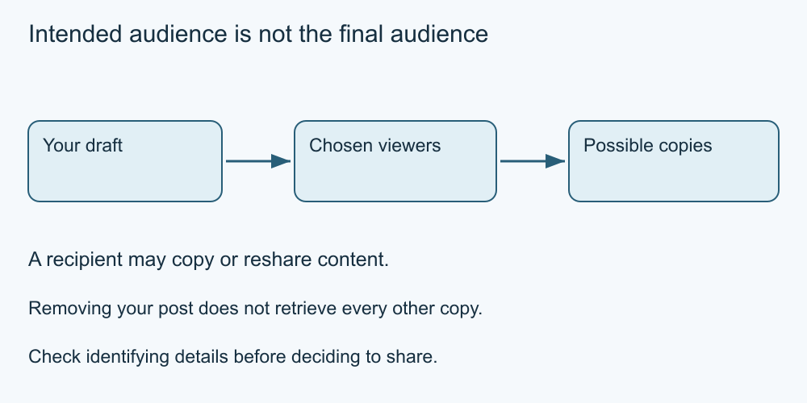

# 3. Know the audience and the limits

[Course home](../README.md) · [Curriculum](../CURRICULUM.md)

**Learning goal:** Distinguish intended viewers from people who may receive a copy.

Before posting, identify the intended audience. A public post, a restricted group and a direct message are different starting points. Settings can limit some access, but recipients may copy, describe or reshare what they see. A private group is not a promise that its content will remain within it.

A digital footprint includes information left through online activity. For our sharing exercise, focus on the content you are about to disclose: the caption, photograph, visible background, tags and location details. Several ordinary details can together identify someone or reveal a routine.

Removing your own post does not establish that everyone else's copies disappeared. A screenshot or forwarded message may remain elsewhere. That limit is a reason to choose carefully, not a claim that every post will inevitably spread.

Read the meaning of a setting before depending on it. “Private” could describe who can initially see a post, while the provider still processes it under its policies. A control for tags may differ from a control for visibility. Never change real settings for this exercise.

Our model has three stages: the sender selects an audience; the audience receives the material; someone may make another copy. Think about each stage when choosing what to include.

*Original simplified teaching diagram. The surrounding explanation provides a text equivalent; this is not a platform screenshot.*

## Worked example

Sam prepares an event photo for a small group. A board behind the subject shows a personal telephone number. Sam chooses a text-only summary instead. Restricting the audience would not remove that number from the image.

## Try it — paper is enough

A fictional group has six members. One shares a screenshot with a colleague. How many people were intended to see it? Can you now know the final audience size?

## Answer and reasoning

Six were intended, but the final size is unknown because copies may continue. The exercise does not establish a specific platform rule or that the colleague will reshare it.

## Use it somewhere else

List three details to inspect in a fictional image before sharing. Use invented details only.

## Sources and limits

[Canadian privacy guidance](https://www.priv.gc.ca/en/privacy-topics/technology/online-privacy-tracking-cookies/online-privacy/social-media/02_05_d_74_sn/) · [Privacy settings guidance](https://www.priv.gc.ca/en/privacy-topics/technology/online-privacy-tracking-cookies/online-privacy/gd_ps_201903/) See [source notes](../SOURCES.md) for dates and scope. No live account or device procedure was tested.

[Previous lesson](02-feeds.md) · [Next lesson](04-consent.md)

