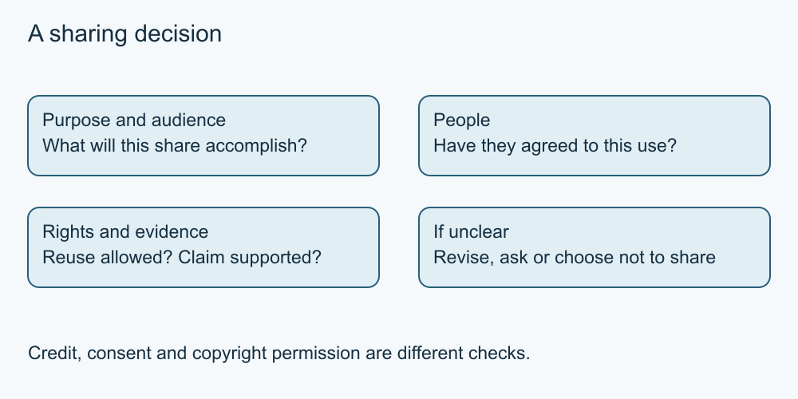

# 4. Ask before sharing someone else's story

[Course home](../README.md) · [Curriculum](../CURRICULUM.md)

**Learning goal:** Make a sharing choice that respects a specific person's boundary.

Consent in this lesson means seeking a clear agreement for the particular sharing you propose. Being in a photograph does not tell you whether someone wants it posted. Agreeing to a small group's use does not automatically mean agreeing to a public promotion.

Ask what will be shared, where, with whom and for what purpose. Give a person a real option to decline. Silence, an old permission for a different activity or pressure from others is not a sound basis for this exercise's decision. If the agreement is unclear, choose material that does not expose the person.

Consent is also separate from copyright permission. A photographer may control rights in an image while a depicted person has privacy concerns. One person's permission may not resolve all the relevant questions. Lesson 9 introduces reuse rights; neither lesson settles every jurisdiction's legal requirements.

If someone changes their mind, take their request seriously and consider the action you can control. You might remove your post or ask a recipient to remove a copy, while acknowledging you cannot guarantee retrieval of every copy. Do not blame the person for having agreed earlier.

This is a practical respectful-sharing principle. Legal duties depend on context and location; no universal legal test is asserted here. All scenarios are fictional, and no real person's story is needed.

*Original simplified teaching diagram. The surrounding explanation provides a text equivalent; this is not a platform screenshot.*

## Worked example

Lee agreed to let Sam show a sketch privately but said “please do not post my photo.” Sam can share an allowed sketch under its reuse terms without including Lee's picture or identifying story. Sam does not treat friendship as permission.

## Try it — paper is enough

A fictional volunteer allows a photo in a club newsletter. A sponsor asks to use it in a public advertisement. Is the earlier agreement enough for this exercise? What is a respectful next step?

## Answer and reasoning

No: the audience and purpose changed. Ask about the specific new use without pressure and check other rights, or choose a different asset. Declining publication is an acceptable result.

## Use it somewhere else

Draft a short fictional permission question that names the material, audience and purpose and makes refusal easy. Leave it unsent.

## Sources and limits

[Canadian privacy guidance](https://www.priv.gc.ca/en/privacy-topics/technology/online-privacy-tracking-cookies/online-privacy/social-media/02_05_d_74_sn/) See [source notes](../SOURCES.md) for dates and scope. No live account or device procedure was tested.

[Previous lesson](03-audiences.md) · [Next lesson](05-check-posts.md)

