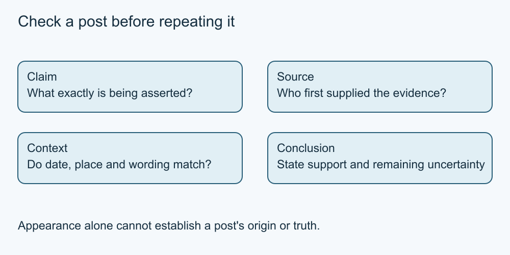

# 5. Check before repeating a claim

[Course home](../README.md) · [Curriculum](../CURRICULUM.md)

**Learning goal:** Write a supported conclusion while keeping uncertainty visible.

First identify the claim. A post may mix a checkable statement, personal opinion and promotion. “The workshop starts at two” is different from “this is the best workshop.” Ask who published it, what supports it, when it was relevant and whether the context matches your question.

Trace a quotation or image back toward its original source. A screenshot can omit the date or surrounding explanation. Multiple reposts can share one mistaken source. When sources conflict, record the conflict and look for a relevant correction rather than choosing the most exciting version.

An emotional reaction is a reason to pause, not proof that the post is false. A polished image or familiar voice is not proof of authenticity. Conversely, an odd-looking detail does not by itself establish AI generation. Edited or generated media can require provenance and corroborating evidence to assess; this course does not teach a reliable visual detector.

A reverse image search can sometimes find earlier uses, but no result does not prove an image is new or authentic. This course supplies fictional source cards instead of asking you to upload images to a search service.

Use a short note: claim, source, date, supporting evidence and remaining question. You may decide not to share until the gap is resolved.

*Original simplified teaching diagram. The surrounding explanation provides a text equivalent; this is not a platform screenshot.*

## Worked example

Card A says a fictional event starts at 13:00. Card B is the organiser's later correction to 14:00 for the same event. Card C repeats A. Sam cites B, explaining that the time changed, rather than counting two cards against one.

## Try it — paper is enough

A caption says “today's crowd,” while the supplied original image card dates the image to last year. What can you conclude? Does that prove the image was generated by AI?

## Answer and reasoning

The image does not support the caption's claim about today's crowd. The mismatch alone does not establish how the image was made or why someone reused it. State the mismatch without inventing intent.

## Use it somewhere else

Write a two-sentence correction to the fictional time claim, citing B without insulting the person who repeated A.

## Sources and limits

[Canada: checking online information](https://www.canada.ca/en/campaign/online-disinformation.html) See [source notes](../SOURCES.md) for dates and scope. No live account or device procedure was tested.

[Previous lesson](04-consent.md) · [Next lesson](06-scams.md)

