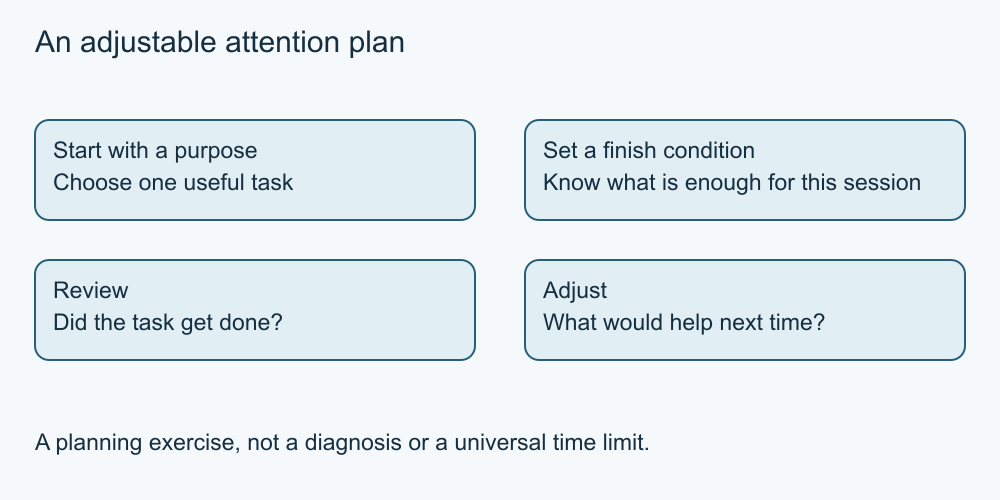

# 8. Make an intentional attention plan

[Course home](../README.md) · [Curriculum](../CURRICULUM.md)

**Learning goal:** Design a small, adjustable routine around a chosen purpose.

Ask whether your activity is serving the purpose you chose. A session that began with checking an event may continue into unrelated posts. That observation is enough to reconsider your plan; it does not diagnose a condition or prove that a particular feature caused harm.

Choose a cue to start, a useful task and a stopping point. For example: after lunch, read the organiser's latest notice, write down the answer and close the session. Leave room for exceptions that you choose deliberately. A flexible plan is easier to assess than “never waste time again.”

Notifications and automatic playback can create invitations to continue. If you want to change a real setting, first understand its effect and whether you are authorised to change it. Work, care and accessibility needs can affect what is practical. Our required exercise changes no device settings.

Evaluate the plan by the goal, not a universal screen-time target. Did the task get done? Was something important displaced? What would you adjust next time? A short fictional log is enough. Do not collect private histories or compare people competitively.

This is a planning exercise, not a treatment or a promise of improved mental health. If someone wants help with a personal concern, they can choose appropriate qualified support without sharing it with the class.

*Original simplified teaching diagram. The surrounding explanation provides a text equivalent; this is not a platform screenshot.*

## Worked example

Sam plans ten minutes for the event question but finds no answer. Instead of treating the time limit as failure, Sam writes the missing question and leaves it for a later verified enquiry. The goal was useful information, not exhausting the feed.

## Try it — paper is enough

Fictional log: goal—find date; result—date found in three minutes; next—twenty minutes of unrelated clips. Propose one change and one fair way to evaluate it.

## Answer and reasoning

Set a stopping cue when the answer is recorded, then check whether the next planned session ends there. Other answers may work. The exercise does not establish a clinically ideal duration or require perfect compliance.

## Use it somewhere else

Create a plan for a different fictional purpose with a start cue, finish condition and revision question.

## Sources and limits

Original fictional teaching exercise, not a measured learning outcome. See [source notes](../SOURCES.md) for dates and scope. No live account or device procedure was tested.

[Previous lesson](07-participation.md) · [Next lesson](09-create-credit.md)

