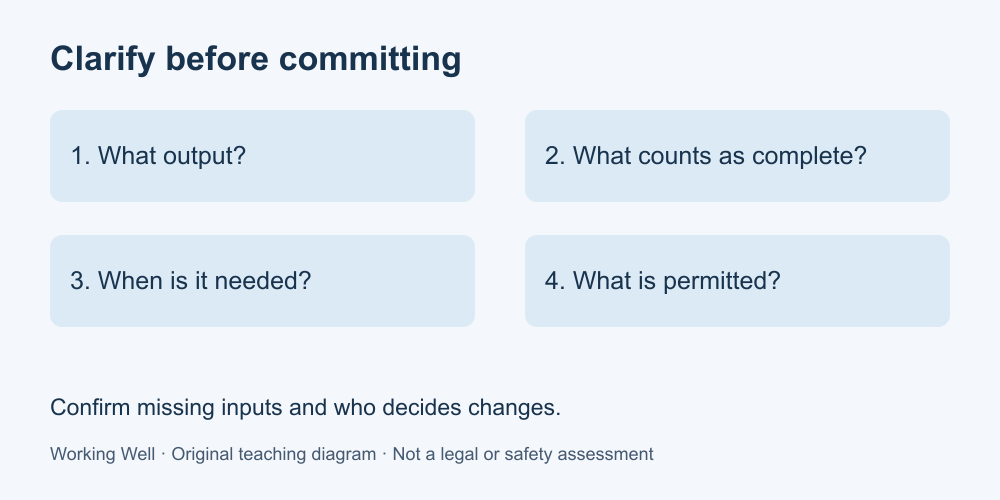

# 2. Clarify a task before committing

[Course home](../README.md) · [Glossary](../GLOSSARY.md)

**Goal:** Turn an ambiguous request into a checkable task agreement.

Adults 18+. All workplaces, people, policies and task timings in these exercises are fictional. Work on paper; no real workplace access or disclosure is required.

## Understand

A task becomes easier to assess when the requested result is clear. Our editorial checklist asks: What output? For whom? By when? What counts as complete? Which inputs and permissions are available? Who resolves changes?

A deadline without an agreed scope can hide disagreement. “Prepare the report today” could mean a rough draft or an approved document. Ask the smallest questions that would change what you do. Then summarize your understanding so the requester can correct it.

Use a proposed commitment when information is missing: “If the figures arrive by the agreed time, I can prepare this draft; otherwise I will update you.” A conditional plan is not a guaranteed result. Do not replace required training or authorization with confidence.

Text equivalent: Output, completion criteria, deadline and permissions: confirm the task before committing.

## Worked example

Pat asks Noor to “tidy the stock report.” Noor asks whether the request means formatting or correcting inventory records. Pat confirms: format the supplied fictional table into one page, preserve its numbers, mark missing entries, and return a draft by 11:00 for Pat's review. This defines both the output and the limit: Noor must not invent stock counts.

## Practise

A requester says, “Send something to the client this afternoon.” Write four clarification questions covering audience, content, timing and approval. Then write a draft summary that labels unanswered items.

## Suggested reasoning

Possible questions: Which client contact? What exact content and format? What time and time zone? Who approves external sending? A summary might say, “I can prepare a draft once the content is confirmed; the recipient, deadline and sending approval are still unconfirmed.” Do not invent a recipient or send merely because the request sounds urgent.

## Try a new situation

A fictional task says “check all records” but supplies only one page. Write a question about scope and a statement of what you can currently verify. Check that you do not claim to have checked unavailable records.

[Source notes](../SOURCES.md) · [Next lesson](03-plan.md) · [Reuse](../LICENSE.md)
