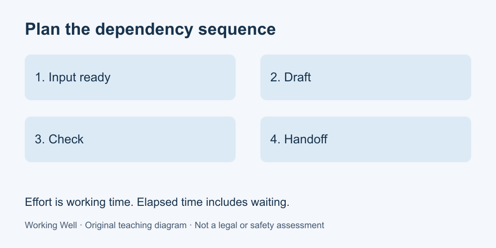

# 3. Plan realistic work

[Course home](../README.md) · [Glossary](../GLOSSARY.md)

**Goal:** Build a feasible schedule from durations and dependencies.

Adults 18+. All workplaces, people, policies and task timings in these exercises are fictional. Work on paper; no real workplace access or disclosure is required.

## Understand

Effort is the time spent working on a task. Elapsed time also includes waiting and gaps. Some tasks can begin only after an input arrives or another task finishes. Adding effort alone can therefore understate the completion time.

For the examples, use one worker, sequential tasks and the exact available work windows supplied. Durations are fictional teaching assumptions, not productivity targets. Real estimates can change; name that uncertainty and communicate material changes. Do not fill a conflict by assuming unpaid overtime or skipping a required check.

Write each task, its estimated effort, prerequisite and earliest start. A plan with every slot occupied has no contingency for an unexpected delay.

Text equivalent: Input ready → draft → check → handoff. Waiting changes elapsed time.

## Worked example

Available window: 09:00–11:00. Drafting takes 30 minutes; the required input arrives at 09:20. Checking takes 20 minutes after drafting. Handoff takes 10 minutes after checking. Earliest schedule: wait until 09:20; draft 09:20–09:50; check 09:50–10:10; hand off 10:10–10:20. Effort is 60 minutes, elapsed time from 09:00 is 80 minutes, and 40 minutes remain in the window. These are schedule margins, not permission to add unrelated work.

## Practise

Available window: 13:00–14:30. Task A takes 25 minutes but its input arrives at 13:15. B takes 20 minutes after A; C takes 15 minutes after B. Give start/end times and remaining margin. If an extra 20-minute task is requested afterwards, can all four fit sequentially in this window?

## Suggested reasoning

A: 13:15–13:40; B: 13:40–14:00; C: 14:00–14:15. Effort is 60 minutes; elapsed time is 75 minutes; margin is 15 minutes. The extra task would finish at 14:35, five minutes late. Ask for a priority or scope decision; do not claim the original deadline still fits.

## Try a new situation

A 10-minute check becomes 25 minutes. Explain which later commitments need recalculation. Check: the change adds 15 minutes if that check lies on the sequential path; a different dependency structure would need its own calculation.

[Source notes](../SOURCES.md) · [Next lesson](04-progress.md) · [Reuse](../LICENSE.md)
