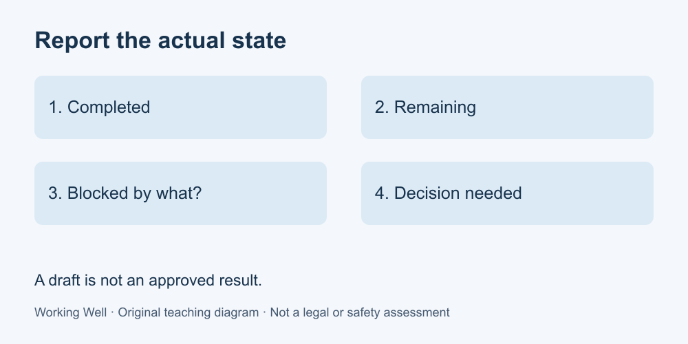

# 4. Communicate useful progress

[Course home](../README.md) · [Glossary](../GLOSSARY.md)

**Goal:** Write an update that distinguishes facts, uncertainty and decisions.

Adults 18+. All workplaces, people, policies and task timings in these exercises are fictional. Work on paper; no real workplace access or disclosure is required.

## Understand

A useful update lets a recipient act. Separate what is complete, what remains, what prevents progress and what decision is needed. Include a relevant time or next checkpoint when it helps.

“Nearly done” is hard to interpret. “Draft complete; two totals unchecked because the source page is missing” gives a clearer state. A blocker is something preventing the next required step. A risk is something that might cause a problem; do not report one as the other.

Keep the update proportionate to the task. A routine note does not need a long report. Do not say a file was received, approved or accepted simply because you sent it.

Text equivalent: Completed, remaining, blocked and decision needed: report each state accurately.

## Worked example

At 10:00 Noor has formatted the stock draft. One source page is missing. Noor writes: “Formatting is complete. I have not checked the final total because page B is unavailable. Please supply page B or confirm a revised draft scope. I will update the completion estimate once that is resolved.” This tells Pat both what can be used and what remains uncertain.

## Practise

Fictional facts: three of four sections are drafted; the fourth requires a confirmed address; no reviewer has approved anything; an update is due now. Write a short progress note with a clear question. Do not use a percentage to imply quality approval.

## Suggested reasoning

One answer: “Three sections are drafted, with review pending. Section four needs the confirmed address. Can you confirm the address or tell me whom to ask? I will update the delivery estimate after that input.” Other concise versions work if they preserve the distinction between drafted and approved.

## Try a new situation

A file upload reports an error. Write an update distinguishing a failed attempt from delivery. Check that you do not tell the recipient the file is ready until you have evidence of a usable transfer.

[Source notes](../SOURCES.md) · [Next lesson](05-handoff.md) · [Reuse](../LICENSE.md)
