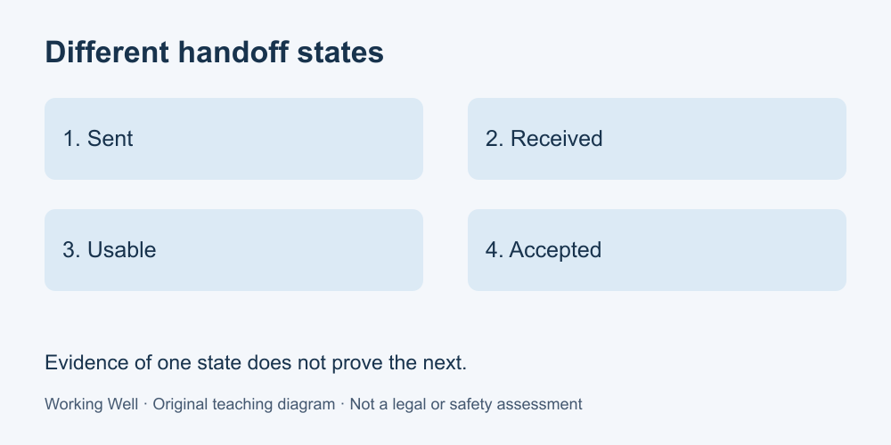

# 5. Collaborate and hand over

[Course home](../README.md) · [Glossary](../GLOSSARY.md)

**Goal:** Provide enough context for another person to continue.

Adults 18+. All workplaces, people, policies and task timings in these exercises are fictional. Work on paper; no real workplace access or disclosure is required.

## Understand

A handoff connects one person's output to another person's next action. Include the purpose, exact item or version, current status, unresolved work, next responsibility and how to confirm that the recipient can use it.

Sent, received, usable and accepted are different states. A message may be sent without arriving; a recipient may receive an unreadable file; a usable draft may still fail review. Report only the state you can establish.

Agree responsibilities rather than silently transferring them. Use the authorized sharing channel and include only the information needed. A copied manager or a read receipt does not automatically approve a decision.

Text equivalent: Sent, received, usable and accepted are different states.

## Worked example

Noor's handoff says: “Stock-summary draft v2, based on training sheet B. Formatting and arithmetic checks completed; one item label remains unconfirmed. Pat: please review that label and decide whether this draft can be used. Please confirm the attachment opens.” Pat's reply “It opens” establishes usability, not approval. Noor records approval as pending.

## Practise

A colleague leaves a file called final-final on a shared drive with no message. List four missing pieces of handoff information. Draft a request that does not accuse the colleague of carelessness.

## Suggested reasoning

Ask what the file is for, which version is current, which checks have been done and what action you are expected to take. For example: “Could you confirm the current version, its review status and the next step you want me to own?” The filename alone cannot establish completion.

## Try a new situation

A recipient says they cannot access the folder. Explain why the handoff is not yet usable and identify an authorized next step. Check: do not suggest sharing your password or making confidential files public.

[Source notes](../SOURCES.md) · [Next lesson](06-quality.md) · [Reuse](../LICENSE.md)
