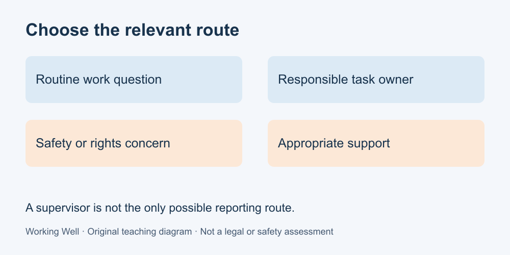

# 9. Raise concerns and find support

[Course home](../README.md) · [Glossary](../GLOSSARY.md)

**Goal:** Distinguish a routine work question from a safety or rights concern.

Adults 18+. All workplaces, people, policies and task timings in these exercises are fictional. Work on paper; no real workplace access or disclosure is required.

## Understand

Match the concern to the appropriate route. A missing input may need the task owner. A potential hazard needs the workplace's safety process and competent help. A harassment or rights concern may need an alternative designated contact, a worker representative or a relevant external service.

Do not assume a person must confront the subject of a complaint first. Ontario Human Rights Commission guidance discusses this concern in complaint-process design. It is a source for the principle, not an individualized legal decision. If a supervisor is involved, look for an appropriate alternative rather than treating that supervisor as the only route.

In a real emergency, use local emergency assistance and applicable emergency procedures. Do not attempt unfamiliar equipment operation or repairs as a course exercise. This lesson does not supply a universal work-refusal procedure.

Text equivalent: Routine work, safety concerns and harassment or rights concerns need appropriate routes.

## Worked example

At fictional Maple Desk, the supplied policy names the task owner for deadline questions, the safety contact for hazards and an alternate complaints contact when a supervisor is involved. A missing stock page goes to the task owner. A threatening supervisor is not merely a formatting problem; the alternate route may be relevant. The course does not predict what an investigation would find.

## Practise

Classify: A, two task owners give conflicting deadlines; B, a person is asked to use equipment without needed training; C, a worker reports repeated threats by the supervisor named as the usual contact. Give a type of next contact and one uncertainty for each. Do not actually contact anyone.

## Suggested reasoning

A: ask for a priority decision from the responsible task owners; their actual authority is unknown. B: do not improvise the equipment task; obtain competent safety guidance and the relevant procedure; hazards and required training are unknown. C: identify an alternate designated or suitable external support route; the applicable process and urgency need checking. None of these answers guarantees confidentiality, protection from retaliation or a particular outcome.

## Try a new situation

For a fictional pay question, write what jurisdiction information would be needed before relying on a rule. The Canadian federal-industry reference below distinguishes federal coverage from provincial/territorial routes; a location alone may not settle coverage. Do not calculate an entitlement from this exercise.

[Canadian federal coverage and provincial/territorial links](https://www.canada.ca/en/services/jobs/workplace/federally-regulated-industries.html) · [CCOHS hazard reporting](https://www.ccohs.ca/oshanswers/hsprograms/report.html) · [Ontario complaint-process guidance](https://www.ohrc.on.ca/en/policy-primer-guide-developing-human-rights-policies-and-procedures/6-procedures-resolving). Checked 11 September 2026. External routes have their own coverage and procedures; verify current details for a real case. GitHub and publisher email are not emergency or legal-support services.

[Source notes](../SOURCES.md) · [Next lesson](10-project.md) · [Reuse](../LICENSE.md)
